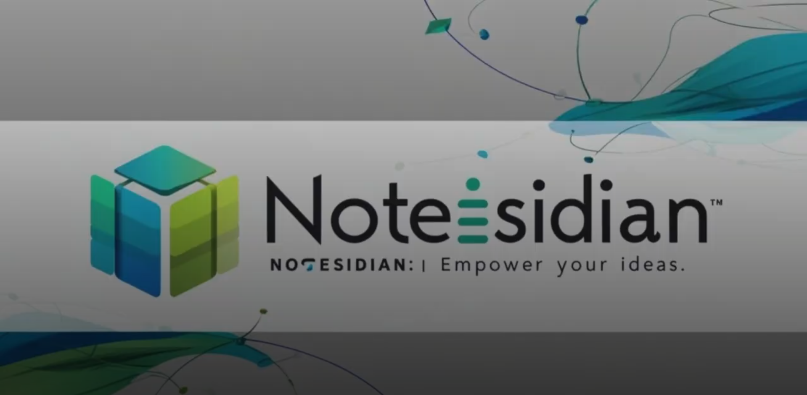

# Notesidian

<br>
<p align="center">
  
</p>
<br>

## Overview

Notesidian is a note management and analysis application that uses machine learning to cluster, search, and visualize relationships between notes. It is designed for researchers, students, and professionals who want to organize and analyze large volumes of information efficiently. Key features include semantic clustering, similarity search, and a knowledge graph for visualizing connections.

The application also integrates GPT-based Retrieval-Augmented Generation (RAG) for Q&A functionality using your notes.

## Features

- **📝 Note Management**

  - Create, edit, and delete notes through an intuitive interface.
  - Upload and process text or PDF files as notes.
  - Automatically generate summaries for your notes with distilbart-cnn-12-6 _(optimized for gpu with FP16)_.

- **📊 Semantic Clustering**

  - Automatically group notes into clusters using MiniLM-L6-v2 embeddings and Affinity Propagation.
  - Visualize clusters in 2D with PCA and Plotly.

- **🔍 Note Similarity Search**

  - Search for similar notes using semantic embeddings.
  - View summaries and content of similar notes.

- **🌐 Knowledge Graph**

  - Visualize notes as an interactive graph using PyVis.
  - Manually add or remove relationships between notes to represent relationships.

- **💬 Q&A with GPT**
  - Use RAG to retrieve relevant notes and answer questions contextually.
  - View summaries of retrieved notes for each query.

## Video

<p align="center">
  <a href="https://drive.google.com/file/d/1hY9Ha8erH-HxJk4ALLBXXwInL9kPdqbQ/view?usp=drive_link" target="_blank">
    
  </a>
</p>

## Setup Instructions

### Clone the Repository

```bash
git clone https://github.com/benjaminfranklin03/CS-Project.git
cd CS-Project
```

### Install dependencies

```bash
pip install -r requirements.txt
```

### Set the OpenAI API Key

The application requires an OpenAI API key to use the RAG feature with GPT models. You can set it up using any of the following methods:

#### A. Set it temporarily in your shell

- **For Bash (Linux/MacOS):**

```bash
export OPENAI_API_KEY=your-api-key
```

- **For Windows Command Prompt:**

```bash
set OPENAI_API_KEY=your-api-key
```

- **For PowerShell:**

```bash
$env:OPENAI_API_KEY="your-api-key"
```

### Running the App

```bash
streamlit run app.py
```

## Contribution Matrix

| **Task**               | **Ben Mulder** | **Artan Sadriji** | **Frederick Ohle** | **Alex Degenhardt** |
| ---------------------- | :------------: | :---------------: | :----------------: | :-----------------: |
| **Project Management** |       ★        |         ●         |         ◐          |          ○          |
| **Conceptualization**  |       ★        |         ●         |         ●          |          ◐          |
| **Code Development**   |       ★        |         ○         |         ○          |          ○          |
| **Documentation**      |       ★        |         ○         |         ○          |          ○          |
| **Presentation**       |       ★        |         ●         |         ●          |          ○          |
| **Video**              |       ●        |         ◐         |         ◐          |          ★          |

---

### Legend

- **★** Main Contributor
- **●** Contributor
- **◐** Supporting Role
- **○** No Contribution

## Acknowledgment

Specific parts of this project, including the CSS injection, were developed with guidance from language models by OpenAI.
